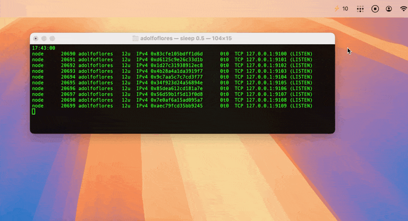

# ⚡️ Node Killer

[](https://www.electronjs.org/)
[](https://developer.apple.com/macos/)
[](./LICENSE)

⚡️ **Node Killer** — a sleek macOS menubar app that keeps an eye on your **Node.js**, **Vite**, and **Bun** dev servers and lets you kill them with a click.

> 🖥️ Currently available only for Apple Silicon (arm64).


## ✨ Features
- 📊 **Live counter** in the status bar — instantly shows how many dev servers (Node.js, Vite, Bun) are listening (`active: 4`).  
- 🖱️ **Interactive tray menu** — lists every active process with its type, PID, and ports when available.  
- 🔪 **One-click kill** — terminate individual Node/Vite/Bun processes with success/error notifications.  
- 💣 **Kill all** — wipe out every running process of the enabled types, with confirmation and summary.  
- 🔄 **Smart auto-refresh** — updates every 5 seconds plus a manual **Refresh** option.  
- 🧰 **Customizable preferences** — adjust refresh rate, auto-launch, status-bar display mode, and which process types to monitor.
- ✅ **Process type toggles** — enable or disable Node.js, Vite, and Bun scanning directly from Preferences.


## 🚀 Getting Started

For development:

```bash
npm install
npm run dev
```

Node Killer lives in the macOS menu bar near the clock. 


## 📥 Download

You can grab the latest pre-built binary from the [Releases page](https://github.com/adolfoflores/node-killer/releases).

👉 Direct download for Apple Silicon (M1/M2/M3/M4):  
[Node-Killer-0.1.0-arm64.dmg](https://github.com/adolfoflores/node-killer/releases/download/0.1.0/Node-Killer-0.1.0-arm64.dmg)

> 🖥️ Currently only Apple Silicon (arm64) builds are provided.  
> macOS will ask for confirmation the first time you run the app.  

## 🎥 Demo



## 📦 Build

Create a `.app` and `.dmg` bundle with [electron-builder](https://www.electron.build/):

```bash
npm run build
```

Artifacts are written to `dist/`. 


## ⚠️ Limitations
- Processes are detected via `lsof -nP -iTCP -sTCP:LISTEN` parsing.
- Containers (Docker) usually appear as `docker-proxy`, so underlying Node processes may not be visible.

## 📸 Roadmap
- [ ] Alternate scan mode for Node processes that are not listening on sockets.
- [ ] Basic Linux support.


## 🧪 Manual Smoke Test
1. Start one server for each runtime you use (`next dev`, `vite dev`, `bun dev`, etc.).
2. Run `npm run dev` for Node Killer.
3. Confirm the menu shows each process with the correct label (node/vite/bun), ports, and that disabling a type in Preferences hides its entries.
4. Terminate a single process, then try **Kill all** and review the notifications.


## 🤝 Contributing
Pull requests and feedback are welcome! Feel free to open an issue.

## 📝 License
[MIT](./LICENSE)

